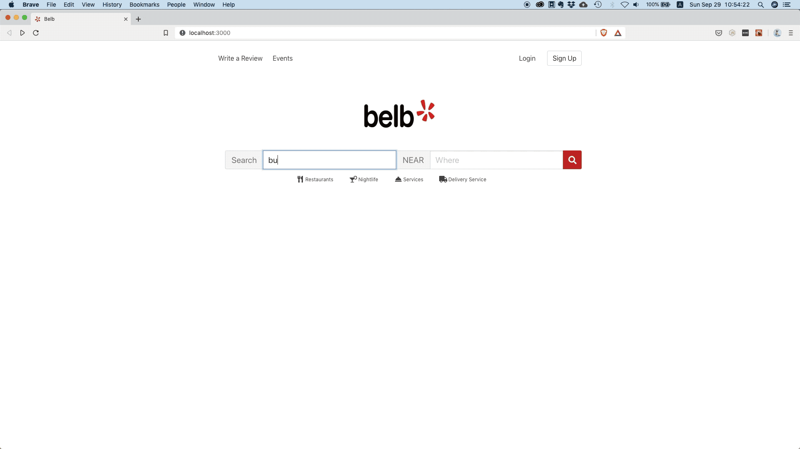

<!--  -->

> _BELB_ is an application to search your lovable spot

[](https://opensource.org/licenses/)
[](https://twitter.com/zourdythedev)

# 🙌 BELB FRONT END

Hello fellow developers! this repository contains restrict content from YELP API, this project is used to learning purposes only
and not for development, hence you cannot deploy this repository please read the `code of conduct.md` and please use this for learning and boost your skillsets
. Thank youu 😙❤

# 🐱‍👤 Demo



## 💃 Contributing

Contributions are always welcome!

See `contributing.md` for ways to get started.

Please adhere to this project's `code of conduct`.

# 💥 Caveats

- This app uses the [CORS Anywhere](https://github.com/Rob--W/cors-anywhere/#documentation) because the [Yelp Fusion REST API](https://www.yelp.com>_ For the sake of the tutorial, we decided to proxy all request through [CORS Anywhere](https://github.com/Rob--W/cors-anywhere/#documentation) so >_ **You should not run this in production because you would expose a `Bearer token` on the client side**. We only did this so that this tutorial ca>\* **DO NOT commit your bearer token to source control if you work on a public repository**.

# ⚡ How to run this Application

This application looks pretty much the same like the original [Yelp](https://www.yelp.com) website.

It leverages the free [Yelp Fusion REST API](https://www.yelp.com/developers/documentation/v3) for which you need an API key.

1. Head over to the [Yelp Fusion API documentation](https://www.yelp.com/developers/documentation/v3)
2. Click on `Create App` and sign in if you haven't done so already
3. Once you have signed in, click on the `Get Started` button. If you already have an app, then you will already see the API key
4. Fill out the form for [creating a new app](https://www.yelp.com/developers/v3/manage_app)
5. Copy the generated `API key`. This is a [bearer token](https://stackoverflow.com/questions/25838183/what-is-the-oauth-2-0-bearer-token-exactly/2>6. Navigate to the `src/hooks/yelp-api/config.js` file and assign the `BEARER_TOKEN` variable the following content
   ```
   const BEARER_TOKEN = '<your-token-here>'
   ```
6. Install the dependencies by running `npm install` or `yarn install`
7. Run the app with `npm start` or `yarn start`

# 🚀 Used Technologies

- [React / create-react-app](https://github.com/facebook/create-react-app)
  - **only functional components**
  - communication with web servers with [React Hooks](https://reactjs.org/docs/hooks-intro.html) only
  - no higher order or class-based components
- [React router](https://github.com/ReactTraining/react-router) with [useReactRouter](https://github.com/CharlesStover/use-react-router)
- [Bulma](https://bulma.io)
- Flexbox

# 🐱‍🏍 Disclaimer

This project is **solely intended for educational purposes** and is created under **fair use**.

It is **not intended to create any kind of Yelp competitor**, but to teach advanced concepts in frontend development.

Just see it a nice educational project that will help you to improve your coding skills.
